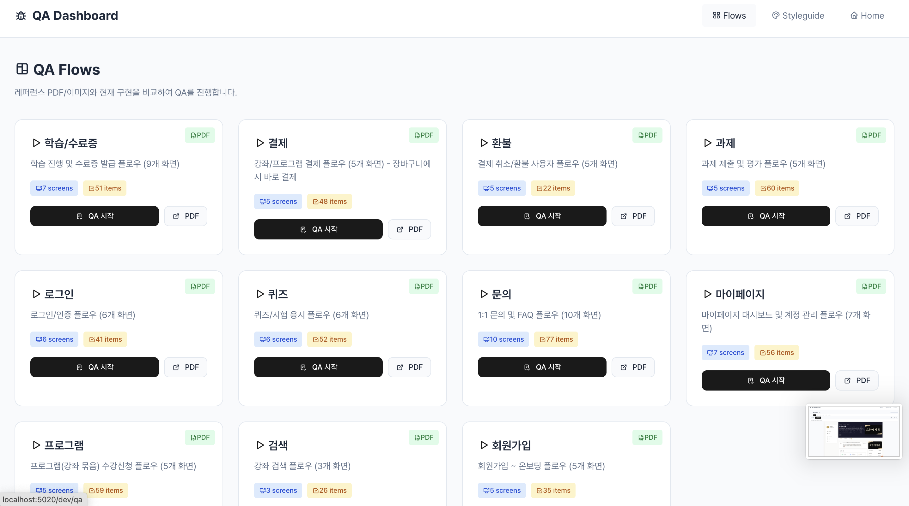
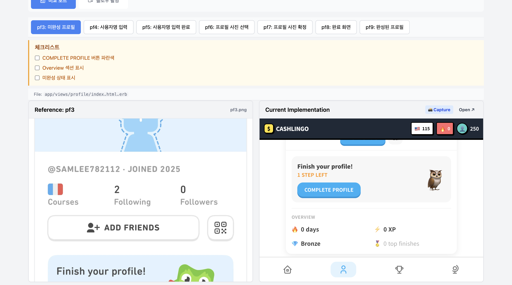
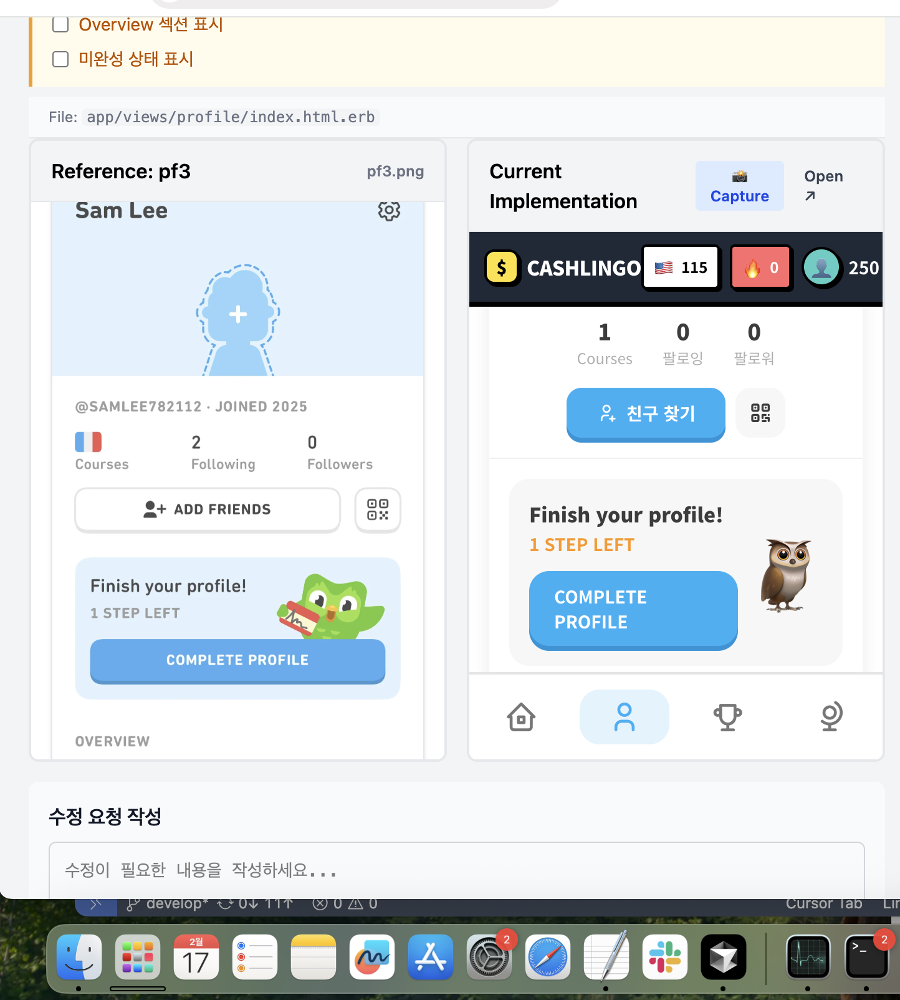

# QA Dashboard Skill

QA 대시보드 관리 및 디자인 검수 워크플로우 자동화 스킬

## 스크린샷

### 1. 대시보드 메인 화면
모든 QA 플로우를 카드 형태로 한눈에 확인할 수 있습니다. 각 플로우별로 화면 수, 체크리스트 항목 수, PDF 문서 링크를 제공합니다.



### 2. 비교 모드 (Compare Mode)
좌측에 레퍼런스 디자인, 우측에 현재 구현을 나란히 비교합니다. 상단 탭으로 화면 전환, 우측 패널에 체크리스트 표시.



### 3. 수정 요청 작성
하단 입력창에서 수정이 필요한 내용을 작성하면 `.claude/qa_requests/{SCREEN_ID}.md`에 자동 저장됩니다.



---

## Trigger Keywords

| 키워드 | 예시 |
|--------|------|
| /QAdashboard | "/QAdashboard newsletter" |
| QA 대시보드 | "QA 대시보드 업데이트해줘" |
| 체크리스트 | "체크리스트 추가해줘" |
| qa_flows | "qa_flows.yml 수정해줘" |

## 핵심 파일 구조

```
config/qa_flows.yml              # QA 플로우 설정 (화면별 체크리스트)
app/controllers/dev/qa_controller.rb  # QA 컨트롤러
app/views/dev/qa/
├── show.html.erb                # 대시보드 메인
├── flow.html.erb                # 플로우 상세 (비교 모드)
└── captures.html.erb            # 캡처 목록
app/views/layouts/dev.html.erb   # Dev 레이아웃 (스타일 포함)
app/javascript/controllers/qa_dashboard_controller.js  # Stimulus 컨트롤러
public/qa_references/{flow_id}/  # 레퍼런스 이미지
.claude/qa_requests/             # 수정 요청 저장 폴더
```

## qa_flows.yml 체크리스트 형식

계층적 번호 체계로 UI 요소 명시:

```yaml
newsletter:
  name: "Newsletter"
  screens:
    - id: NL1
      name: "NL1 - Profile Home"
      url: "/@user"
      reference: "nl1.png"
      checklist:
        - "1. 헤더"
        - "1.1 뒤로가기 버튼 (←)"
        - "1.2 더보기 버튼 (...)"
        - "2. 프로필 영역 (보라색 배경)"
        - "2.1 아바타 (둥근 사각형 + L 아이콘 + 골드 테두리)"
        - "2.2 번개 아이콘 배지"
        - "3. 소개 컨테이너"
        - "3.1 Bio 텍스트"
        - "3.2 Stats 영역 (3개 박스)"
        - "3.2.1 12.4k READERS"
        - "3.2.2 84 ISSUES"
        - "3.2.3 4.9 RATING"
```

**번호 규칙:**
- `1.` - 최상위 섹션
- `1.1` - 섹션 내 요소
- `1.1.1` - 요소 내 세부 항목

## 수정 요청 시스템

### 저장 방식
화면별 단일 MD 파일로 관리 (append 방식):

```
.claude/qa_requests/
├── NL1.md    ← NL1 화면 요청들
├── NL2.md    ← NL2 화면 요청들
└── NL6.md    ← NL6 화면 요청들
```

### 파일 형식
```markdown
# NL1 수정 요청

### 2026-02-13 16:05
프로필 아바타를 둥근 사각형으로 변경해주세요

---

### 2026-02-13 16:10
Stats 영역 간격 조정 필요
```

### 요청 확인 방법
```
"NL1 요청 확인해줘"
"QA 요청 전체 확인해줘"
```

## QA 대시보드 기능

### 1. 비교 모드 (Compare)
- 좌측: Reference 이미지 (디자인)
- 우측: Current 구현 (iframe)
- 우측 패널: 체크리스트

### 2. 갤러리 모드 (Gallery)
- 모든 화면 썸네일 그리드 뷰

### 3. 요청 모드 (Request)
- 현재 선택된 화면 ID 표시
- 수정 요청 텍스트 입력
- 전송 → `.claude/qa_requests/{SCREEN_ID}.md`에 저장

### 4. 줌 기능
- 마우스 휠: 확대/축소
- 드래그: 패닝 (확대 시)
- 버튼: +/- 및 리셋

### 5. 인터랙티브 모드
- iframe 클릭 가능 모드 (실제 동작 확인)

## User Journey 문서

```
claudedocs/Newsletter/newsletter_flow.mmd  # Mermaid 플로우차트
claudedocs/Newsletter/newsletter_flow.png  # 렌더링 이미지
```

### 플로우 섹션
```mermaid
🔐 Auth: NL12 (Login) ↔ NL13 (Signup)
👤 Profile: NL1 (Home) ↔ NL2 (Lists) ↔ NL4 (About) → NL3 (List Detail)
🔍 Explore: NL5 (Search)
📚 Saved: NL6 (Overview) → NL7 (Bookmarks) / NL8 (History)
📰 Content: NL14 (Article) ↔ NL10 (Comments)
⚙️ User: NL9 (Settings), NL11 (Notifications)
```

## 워크플로우

### 1. 새 플로우 추가
```yaml
# config/qa_flows.yml에 추가
new_flow:
  name: "New Flow Name"
  description: "설명"
  screens:
    - id: SCREEN1
      name: "Screen 1"
      url: "/path"
      reference: "screen1.png"
      checklist:
        - "1. 헤더"
        - "1.1 요소"
```

### 2. 레퍼런스 이미지 추가
```bash
# 이미지 저장 위치
public/qa_references/{flow_id}/{reference_filename}.png
```

### 3. 체크리스트 작성 (이미지 분석)
1. 레퍼런스 이미지 Read로 읽기
2. 상단→하단 순서로 요소 파악
3. 계층적 번호 체계로 작성

### 4. 수정 요청 처리
```
1. QA 대시보드에서 요청 전송
2. Claude에게 "{SCREEN_ID} 요청 확인해줘"
3. .claude/qa_requests/{SCREEN_ID}.md 읽기
4. 요청 사항 구현
```

## 접속 URL

```
http://localhost:5020/dev/qa                    # 대시보드 메인
http://localhost:5020/dev/qa/flow/newsletter   # Newsletter 플로우
```

## 관련 파일 수정 시 주의사항

1. **qa_flows.yml**: YAML 문법 주의 (들여쓰기, 따옴표)
2. **dev.html.erb**: 인라인 CSS 포함 (분리 안 됨)
3. **flow.html.erb**: 인라인 JS 포함
4. **screen ID**: 대문자 사용 권장 (NL1, NL2...)
